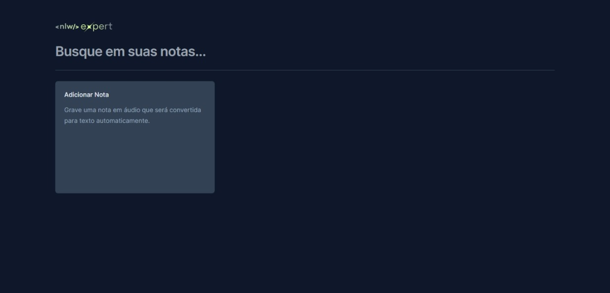
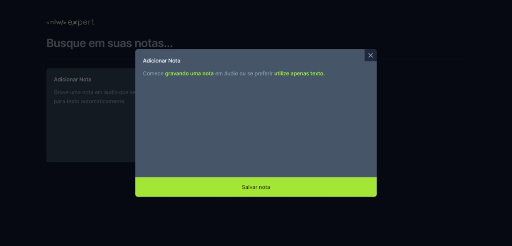
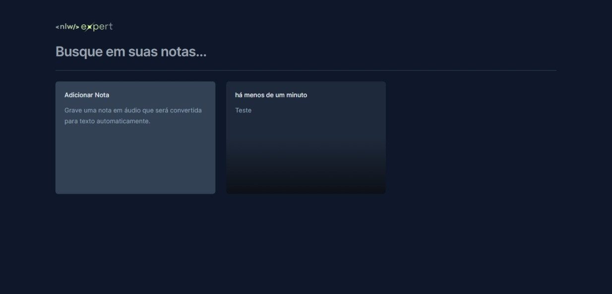
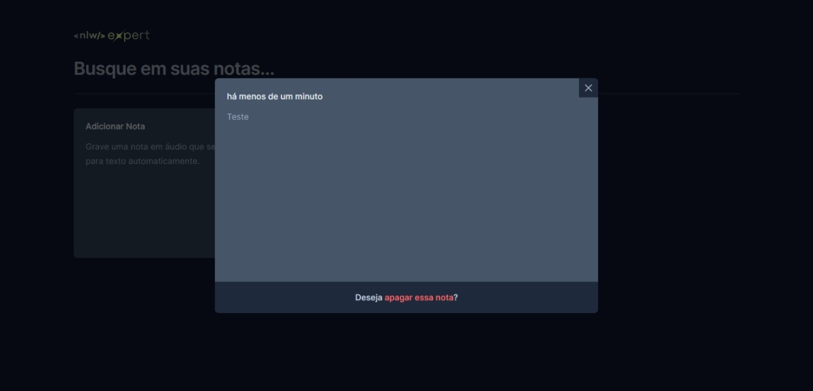
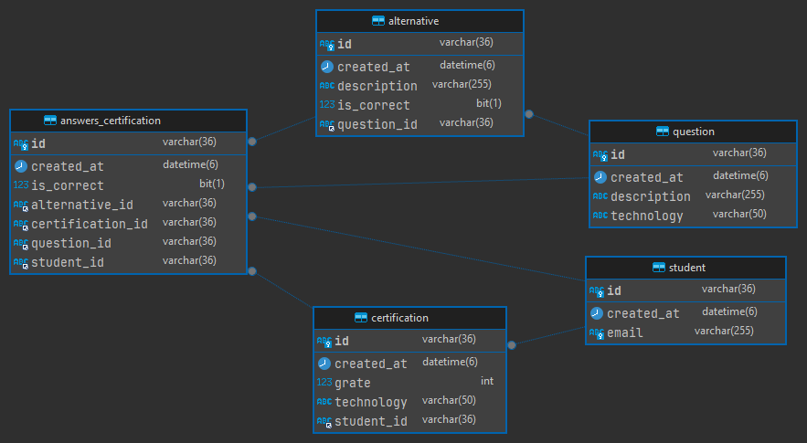

<h1 align="center"> NLW Expert </h1>

Evento exclusivo e gratuito, promovido pela Rocketseat para ensino de tecnologias WEB.

  <a href="#🚀-tecnologias">Tecnologias</a>&nbsp;&nbsp;&nbsp;|&nbsp;&nbsp;&nbsp;
  <a href="#💻-projeto">Projeto</a>&nbsp;&nbsp;&nbsp;|&nbsp;&nbsp;&nbsp;
  <a href="#🖼-screenshot-web">Screenshot</a>&nbsp;&nbsp;&nbsp;|&nbsp;&nbsp;&nbsp;
  <a href="#📝-licença">Licença</a>

  

 

  

## 🚀 Tecnologias

Esse projeto foi desenvolvido com as seguintes tecnologias:

- ReactJS
  - ReactJS
  - Tailwind
  - Typescript
  - Lucide-react
  - Radix UI
  - Sonner
  - Speech Recognition API
- Java
  - Java 17
  - Spring Boot Framework
  - Spring Validation
  - MySQL
  - Rest Assured

## 💻 Projeto

O Nlw Expert foi um evento visando ensinar programação, na prática com 7 trilhas, 7 professores e 7 projetos desenvolvidos simultaneamente 🤯

Na trilha java, foi desenvolvido um projeto backend com o framework Spring Boot. Onde um estudante realiza uma prova de certificação, retorna o resultado da prova com o número de acertos, possui um endpoint que mostra um ranking com os top 10 melhores estudantes que tiraram as melhores notas conforme a tecnologia da certificação.

Na trilha react, foi desenvolvido um projeto frontend. Onde podemos adicionar notas tanto por texto quanto por voz através do Speech Recognition API, realizar buscas e excluir.

## 🖼 ScreenShot Web

  
  
  

## Diagrama Entidade-Relacionamento

  

## 📝 Licença

Esse projeto está sob a licença MIT.

---

Feito com ♥ by Rocketseat :wave: [Participe da nossa comunidade!](https://discord.gg/rocketseat)
